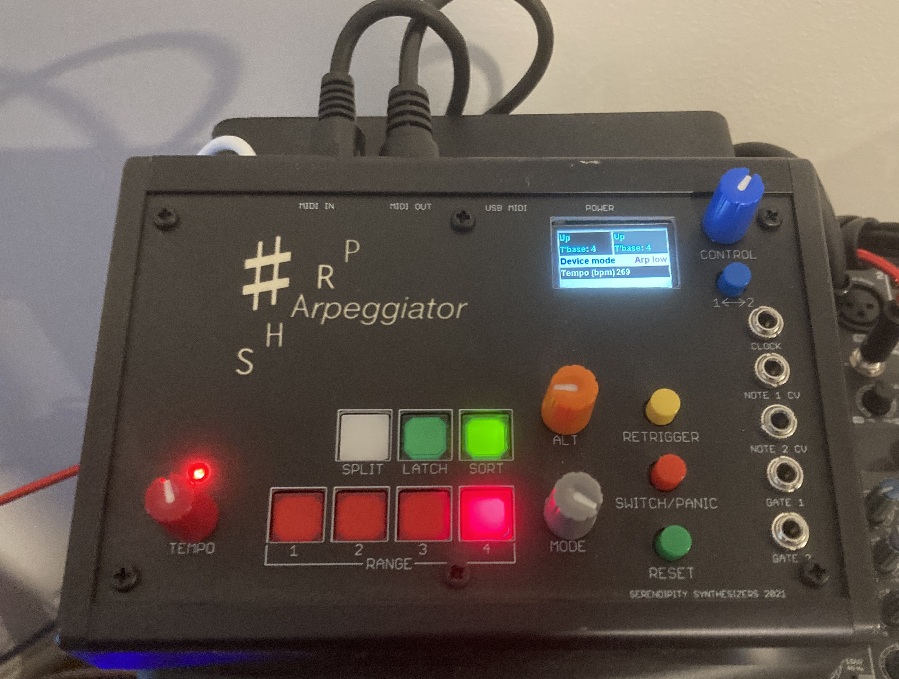

# Sharp
Firmware source and schematics for the Sharp Dual Arpeggiator

<table>
  <tr>
    <td></td>
    <td></td>
  </tr>  
</table>

This is a Teensy 4 based Arpeggiator with a number of special features:

- Multiple basic modes
  - Range of 1 to 4 octaves
  - Standard up, down and up+down
  - In, out and in-out 
  - Random and shuffle
- Variations on the basic modes
  - Repeat every note, every 2nd note, every 2nd note after the 3rd note
  - Play each note over all octaves before proceeding to the next note
  - Double play at double speed the first or last note in the pattern (ratchet)
  - Random walk (small random chance of stepping backwards each step)
  - Half speed chord mode (up to 3 notes in the chord - highest, lowest and one in the middle)
  - Swing beat
- Optional rounding to a timebase of 2, 3 or 4 to ensure the notes played in a cycle fit to a desired multiple
- Latch notes so they don't need to be held down
- Cycle the pattern notes in either note order or played order
- Optionally apply a tempo increase or decrease factor of 2, 3 or 4 to the arpeggio
- Split the keyboard into arpeggiated and not-arpeggiated sections
  - choose any note for the split point
  - arpeggiate either the upper or lower section
  - send both sections to MIDI channel 1, or lower to channel 1 and upper to channel 2
- Support 5-pin MIDI in and out, as well as USB MIDI (as a class compliant host)
- Provides pitch and gate CV outs for integration with modular gear
- Record and replay (transposable) MIDI

# Dual Mode
However, the most interesting and important feature is **Dual mode**.

- Manage two arpeggios at once
- Each arpeggio is driven by the same held notes
- Arpeggio 1 is sent to MIDI channel 1 (and pitch/gate CV 1), and arpeggio 2 is sent to MIDI channel 2 (and pitch/gate CV 2)

## Modes and variations 

Listen:

- the <a href="http://thewessens.net/Sharp/Standard Modes.mp3">Standard Modes</a>
- the <a href="http://thewessens.net/Sharp/AltModes.mp3">Alt Modes</a>
- some simple <a href="http://thewessens.net/Sharp/Simple Dual.mp3">dual arpeggios</a>
- a more complex <a href="http://thewessens.net/Sharp/Dual Demo.mp3">dual arpeggio demo</a> (still comes from just playing a few chords).

Finally, here are some examples of the modes and variations as notation.

